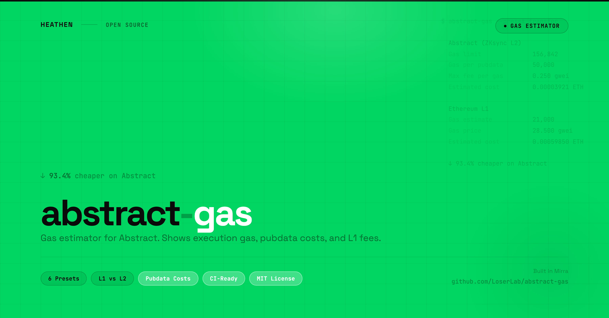

# abstract-gas

<p align="center">
  
</p>

Gas estimator for Abstract (ZKsync L2). Shows execution gas, pubdata costs, and L1 fees.

Compares Abstract vs Ethereum costs for common transaction types. Uses the `zks_estimateFee` RPC for accurate ZKsync-aware estimates.

## Install

```bash
npx abstract-gas
```

Or install globally:

```bash
npm install -g abstract-gas
abstract-gas
```

## Why this exists

Gas on Abstract (ZKsync) works differently from Ethereum:

- **Pubdata costs**: You pay for state diffs published to L1, not just computation. Storage-heavy operations cost more than you'd expect.
- **L1 data availability fees**: The cost fluctuates with Ethereum L1 gas prices.
- **Different gas units**: ZKsync uses ergs internally (5 ergs = 1 EVM gas). The `gasLimit` from `zks_estimateFee` is in ergs.
- **Post-charging model**: Pubdata gas is charged after execution based on actual state diffs, making estimation inherently approximate.
- **Account abstraction overhead**: All accounts are smart contracts. The fixed 21,000 gas intrinsic cost from Ethereum doesn't apply the same way.

Standard gas estimation tools calibrated for EVM give misleading results on Abstract. `abstract-gas` calls the ZKsync-specific `zks_estimateFee` endpoint and breaks down what you're actually paying for.

## Usage

```bash
# Estimate all common transaction types
npx abstract-gas

# Estimate a specific preset
npx abstract-gas -p transfer
npx abstract-gas -p erc20-transfer
npx abstract-gas -p swap
npx abstract-gas -p nft-mint
npx abstract-gas -p deploy

# Custom transaction
npx abstract-gas --to 0x1234... --data 0xabcdef...

# JSON output (for CI/CD)
npx abstract-gas --json

# Include USD costs
npx abstract-gas --eth-price 2000

# Use testnet
npx abstract-gas --testnet

# Skip Ethereum comparison
npx abstract-gas --no-compare
```

## Presets

| Preset | Description |
|---|---|
| `transfer` | ETH transfer (simple send) |
| `erc20-transfer` | ERC-20 token transfer |
| `erc20-approve` | ERC-20 token approval |
| `swap` | DEX swap (Uniswap-style) |
| `nft-mint` | NFT mint (ERC-721) |
| `deploy` | Contract deployment |

## Example Output

```
abstract-gas v0.1.0

ETH transfer (simple send)

  Abstract (ZKsync L2)
  Gas limit              156,842
  Gas per pubdata        50,000
  Max fee per gas        0.250 gwei
  Estimated cost         0.00003921 ETH
                         $0.08

  Ethereum L1
  Gas estimate           21,000
  Gas price              28.500 gwei
  Estimated cost         0.00059850 ETH
                         $1.20

  ↓ 93.4% cheaper on Abstract (0.00055929 ETH saved)
```

## Exit Codes

| Code | Meaning |
|---|---|
| 0 | Estimation succeeded |
| 1 | Estimation failed |

## Programmatic API

```typescript
import { estimateGas, compareGas, buildPresetTx } from "abstract-gas";

// Estimate gas for a preset
const tx = buildPresetTx("transfer");
const estimate = await estimateGas(tx, {
  abstractRpc: "https://api.production.abs.xyz/rpc",
});
console.log(estimate.gasLimit);        // 156842n
console.log(estimate.estimatedCostEth); // "0.00003921"

// Compare Abstract vs Ethereum
const comparison = await compareGas(tx, {
  abstractRpc: "https://api.production.abs.xyz/rpc",
  ethereumRpc: "https://ethereum-rpc.publicnode.com",
  ethPriceUsd: 2000,
});
console.log(comparison.savings?.percentage); // "93.4%"
```

## Part of the Abstract Developer Toolkit

| Tool | What it does |
|------|-------------|
| [abstract-audit](https://github.com/LoserLab/abstract-audit) | Catch EVM incompatibilities in your Solidity contracts |
| [x402-fetch](https://github.com/LoserLab/x402-fetch) | HTTP client for x402 paid API endpoints on Abstract |
| **abstract-gas** (this tool) | Estimate gas costs on Abstract vs Ethereum |

**Recommended workflow:** `abstract-audit` (check contracts) -> `abstract-gas` (estimate costs) -> deploy on Abstract.

## Author

Created by [**Heathen**](https://x.com/heathenft)

Built in [Mirra](https://mirra.app)

## License

MIT License

Copyright (c) 2026 Heathen
